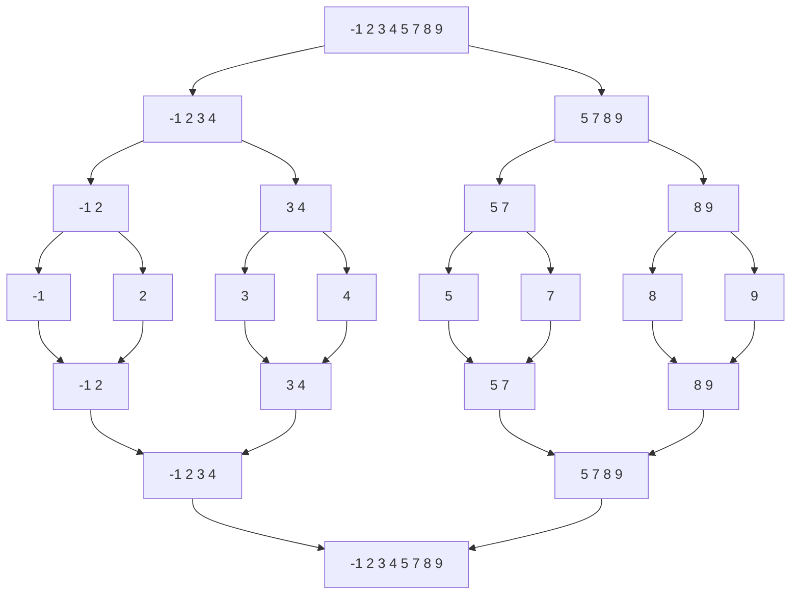
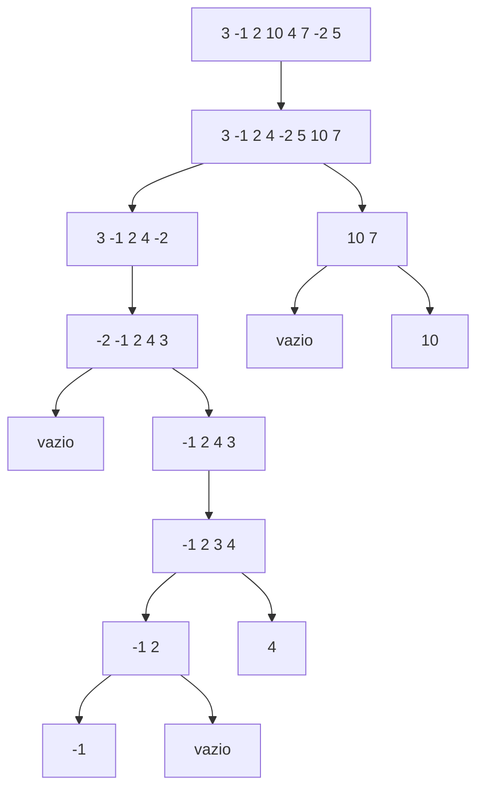
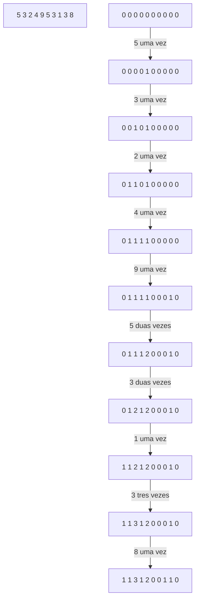

[Ir para o Sumário](../README.md)

# Como medir desempenho?

- algoritmo
- software/ programa

Ex: multiplicação de matrizes

$C_{n \times n} = A_{n \times n} \times B_{nxn}$ => $c_{ij} = \sum_{k=1}^{n} a_{ik} \times b_{kj}$

- O($n^3$) operações

De forma implícita, quando medimos o desempenho de um algoritmo, estamos medindo o tempo de execução.

```c
int maior(int *v, int n){
    int m = v[0]; // executa 1 vez
    for (int i = 1; i < n; i++){
        // 1      ;  n   ; n-1
        if (v[i] > m){ // n-1
            m = v[i]; // no pior caso executa n-1
        }
    }
    return m; // executa 1 vez

    // 1 + 1 + n + n-1 + n-1 + n-1 + 1 <= 4n
}
```

Dizemos que f(n) é O(g(n)) se existem constantes c e n0 tais que $f(n) \leq c \cdot g(n)$ para todo $n \geq n0$.

A notação assintótica é uma notação matemática que descreve o comportamento de uma função quando o seu argumento tende a um valor específico ou ao infinito

Também é possivel representar como um limite tendendo a infinito:

lim n -> ∞ f(n)/g(n) = c

## Outras notações:
- Ω(g(n)) - limite inferior
- Θ(g(n)) - limite superior e inferior
- o(g(n)) - limite estritamente inferior
- ω(g(n)) - limite estritamente superior

## g(n) clássicas
- 1: constante
- log(n): logaritmo
- n: linear
- nlog(n): linearítmico
- $n^k, k \geq 2$: polinomial
- $k^n, k \geq 2$: exponencial
    - n! fatorial também é considerado exponencial

## Exemplo

Suponha um computador que consuma 0,001s por operação.

 n | O(n) | O(nlog(n)) | O(n^2) | O(n^3) | O(2^n) 
:-:|:-:|:-:|:-:|:-:|:-:
16 | 0,016s | 0,064s | 0,256s | 4s | 1m e 4s
32 | 0,032s | 0,16s | 1s | 33s | 46 dias
512 | 0,512s | 9s | 4m e 22s | 1 dia e 3h | $10^{137}$ séc

# Lista Encadeada

São uma forma de armazenar um conjunto de dados alternativa a vetores.

- Cada elemento é um nó
- Cada nó contém um valor e um ponteiro para o próximo nó

Vetores | Listas
:-:|:-:
contíguo | não contíguo
acesso direto O(1) | acesso sequencial O(n) - não indexado
aumentar custa O(n) | aumentar custa O(1)
diminuir custa O(n) <br> ou sub-utiliza | diminuir custa O(1)

## Implementação

```c
typedef struct no{
    int valor;
    struct no *prox;
} No;

// descritor
typedef struct lista{
    No *inicio;
    int tamanho;
    No *fim;
} Lista;
```

Nó-cabeça: nó que aponta para o primeiro nó da lista

# Ordenação por Intercalação (MergeSort)

Baseado na Divisão e Conquista e na recursão (bottom-up)

Divisão: divide o vetor “ao meio”

Conquista: intercale duas “metades” (cada metade deve estar ordenada)

Intercalar: consiste em combinar duas listas ordenadas em uma única lista ordenada. Os elementos são comparados um a um e inseridos na nova lista na ordem correta.

## Implementação

```c
// e: índice da esquerda
// m: índice do meio
// d: índice da direita
void intercala (int *v, int e, int m, int d){
    int *w = (int *) malloc (sizeof(int)*(d-e+1));
    int i=e, j=m+1, k=0;
    while (i <= m && j <= d){
        if (v[i] < v[j]) w[k++] = v[i++];
        else w[k++] = v[j++];
    }
    while (i <= m) w[k++] = v[i++];
    while (j <= d) w[k++] = v[j++];
    // esses ultimos dois laços sao mutuamente exclusivos
    for (k=0, i=e; i<=d; i++, k++) v[i] = w[k];
    free(w);
} // complexidade 2*O(d-e+1)

void mergesort (int *v, int e, int d){
    if (e < d){
        int m = (e+d)/2;
        mergesort (v, e, m);
        mergesort (v, m+1, d);
        intercala (v, e, m, d);
    }
}
```



> Análise da complexidade no google Fotos

# QuickSort (Ordenação por Partição)

Também baseado na Divisão e Conquista e na recursão (top-down)

A cada divisão, resolve o problema da separação (ou particionamento)

Particionamento: escolhe um elemento (pivô) e rearranja o vetor de forma que todos os elementos menores que o pivô fiquem à esquerda e todos os elementos maiores fiquem à direita

Dado um vetor v[e...d], queremos definir um índice j tal que v[e...j-1] <= v[j] < v[j+1...d]

## Como resolver um particionamento

1. Escolher arbitrariamente um elemento do vetor (pivô)
2. Encontrar o índice j e posicionar o pivô neste índice de tal forma que v[e...j-1] <= v[j] < v[j+1...d]

 $\leq$ p | $\leq$ p | $\leq$ p | p | > p | > p | > p | ? | ? | ? | ?
:-:|:-:|:-:|:-:|:-:|:-:|:-:|:-:|:-:|:-:|:-:
e | | j |  | | | | k | | | d

- se v[k] > p, mantenha onde está e incrementa k
- se v[k] <= p, troque v[k] com v[j] e incrementa j e k

## Exemplo

| 3 | -1 | 2 | 10 | 4 | 7 | -2 | 5
|:-:|:-:|:-:|:-:|:-:|:-:|:-:|:-:

| 3 | | | | | | | 5
|:-:|:-:|:-:|:-:|:-:|:-:|:-:|:-:
| | jk |  |  |  |  |  | p

| 3 | -1 | | | | | | 5
|:-:|:-:|:-:|:-:|:-:|:-:|:-:|:-:
| | | jk |  |  |  |  | p

| 3 | -1 | 2 | | | | | 5
|:-:|:-:|:-:|:-:|:-:|:-:|:-:|:-:
| |  | | jk |  |  |  | p

| 3 | -1 | 2 | 10 | | | | 5
|:-:|:-:|:-:|:-:|:-:|:-:|:-:|:-:
| |  |  | j | k |  |  | p

| 3 | -1 | 2 | 4 | 10 | | | 5
|:-:|:-:|:-:|:-:|:-:|:-:|:-:|:-:
| |  |  |  | j | k |  | p

| 3 | -1 | 2 | 4 | 10 | 7 | | 5
|:-:|:-:|:-:|:-:|:-:|:-:|:-:|:-:
| |  |  |  | j |  | k | p

| 3 | -1 | 2 | 4 | -2 | 7 | 10 | 5
|:-:|:-:|:-:|:-:|:-:|:-:|:-:|:-:
| |  |  |  |  | j |  | pk

| 3 | -1 | 2 | 4 | -2 | 5 | 10 | 7
|:-:|:-:|:-:|:-:|:-:|:-:|:-:|:-:
| |  |  |  |  | j |  | pk

## Implementação
```c
void troca(int *a, int *b){
    // o * é o operador unário, faz o dereferenciamento (acessa o endereco de memoria e pega o valor armazenado nele)
    int aux = *a;
    *a = *b;
    *b = aux;
}

int particiona(int *v, int e, int d){
    int p = v[d], j, k;
    for (k=e, j=e; k < d; k++){
        if (v[k] <= p){
            troca(&v[k], &v[j]);
            j++;
        }
    }
    troca(&v[j], &v[d]);
    return j;
} // complexidade O(d-e+1)
void quicksort(int *v, int e, int d){
    if (e < d){
        int j = particiona(v, e, d);
        quicksort(v, e, j-1);
        quicksort(v, j+1, d);
    }
} // complexidade O(n²) para o pior caso
// com a mediana de 3, é possível melhorar o quicksort. No caso médio, a complexidade é O(nlog(n))
```



## Estabilidade

O quicksort não é estável, pois a ordem relativa dos elementos iguais não é preservada.

### Exemplo

| $3_a$ | $3_b$ | 2 |
|:-:|:-:|:-:|
| kj | | |
| j | k | |
| j | | k |
| 2 | $3_b$ | $3_a$ |

### Exercício
Como implementar o quicksort estável?

# Problema: Como encontrar o k-ésimo menor elemento de um vetor?

Quando k=1, o custo é O(n)

Para k=>2:
1. Ordena, recupera o elemento na posição k (ou k-1). O custo é O(nlogn)

## E se ordenarmos parcialmente?

Separa: Dado um vetor v[e...d], queremos definir um índice j tal que v[e...j-1] <= v[j] < v[j+1...d]

Resolver esse problema significa:
- Encontrar a posição "correta" (no vetor ordenado) do pivô
- Rearranja o vetor de tal forma que todos os elementos menores que o pivô fiquem à esquerda e todos os elementos maiores fiquem à direita

## QuickSelect

O separa retorna o j. Se k=j, então já encontramos o k-ésimo menor elemento. Se $k \lt j$, então o k-ésimo menor elemento está à esquerda de j. Se $ j\gt k$, então o k-ésimo menor elemento está à direita de j.

Para encontrar o k-ésimo menor elemento:
- Se $k \lt j$, aplico separação à esquerda
- Se $k \gt j$, aplico separação à direita

Esse algoritmo é conhecido como **QuickSelect**

```c
void quickselect(int *v, int e, int d, int k){
    if (e < d){
        // escolha do pivo (mediana de 3) para evitar o pior caso O(n²)
        int j = particiona(v, e, d);
        // if (k == j) return;
        if (k < j) quickselect(v, e, j-1, k);
        if (k > j) quickselect(v, j+1, d, k);
    }
}
```

### Desempenho

<center>

| 1ª | 2ª | 3 | .... | nª
|:-:|:-:|:-:|:-:|:-:|
| n | n/2 + $\color{green}c$ | n/4 + $\color{green}c$ | .... | 1

$log_n$

</center>


<!-- $T(n) = n + n/2 + n/4 + ... + 1 = 2n - 1 = O(n)$ -->

$$S = \frac{1(2^{lg_2n}-1)}{2-1} = n-1 + {\color{green}c \times log_n} = O(n)$$

### Tipo de aplicação

- Listar os 100 primeiros elementos de um vetor de alunos ordenados pelo IRA:
    - Encontrar o 100º menor elemento
    - Todos os elementos à esquerda são menor que o 100º menor elemento
    - Agora basta ordenar esses 100 elementos
    - É muito mais barato ordenar apenas 100 elementos do que ordenar todos os elementos

# Algoritmos de Ordenação Lineares O(n)

Sempre partem de uma 'premissa' sobre o conjunto de dados.

## Contagem (Counting Sort)  
Premissa: todo elemento do vetor são inteiros e estão no intervalo entre a e b

1. Crie um vetor auxiliar c de tamanho b-a+1 e inicialize com 0
2. Percorra o vetor v e conte a frequência de cada elemento
3. Percorra o vetor c e acumule a frequência
4. Percorra o vetor v de trás para frente e posicione o elemento na posição correta



### Complexidade: O(n+b-a+1)
É vantajoso quando o tamanho do intervalo "pequeno" (neste caso, O(n))

## Radix Sort (Ordenação por destribuição)

Premissa: O conjunto é formado por inteiros positivos com, no máximo, k dígitos

Esse algoritmo percorre o vetor k vezes analisando os digítos menos significativos para os mais significativos.

Também usa 10 filas auxiliares (uma para cada dígito de 0 a 9)

Em um exemplo de 2 dígitos, o algoritmo percorre o vetor duas vezes, uma para as unidades e outra para as dezenas.

É vantajoso quando k for O(log n)

### Complexidade
O(nk)
