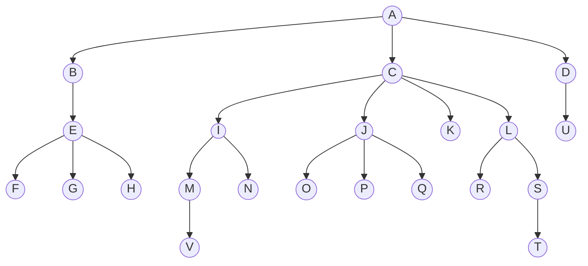
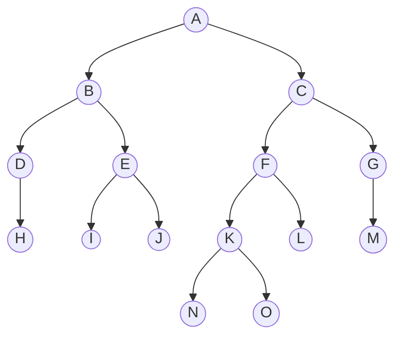
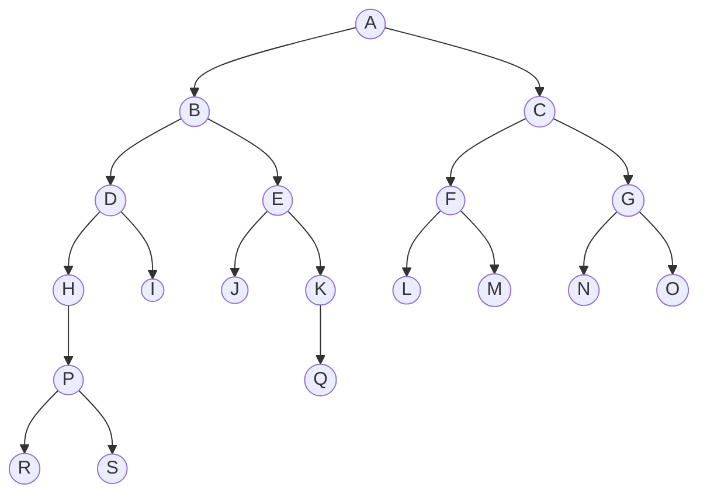
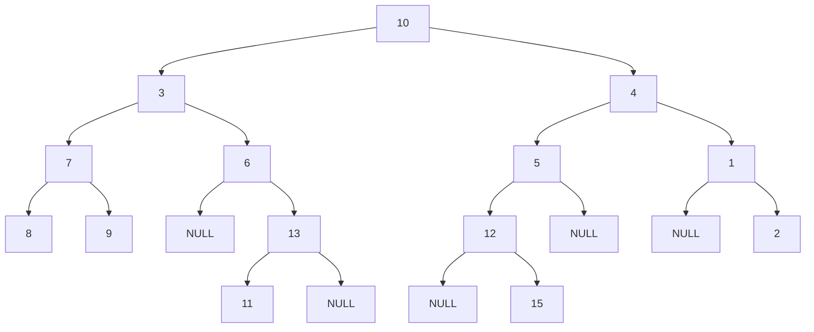
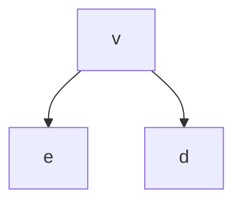
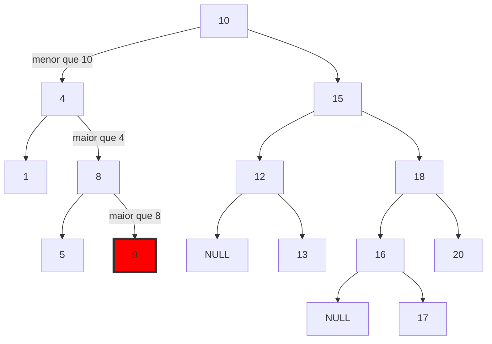
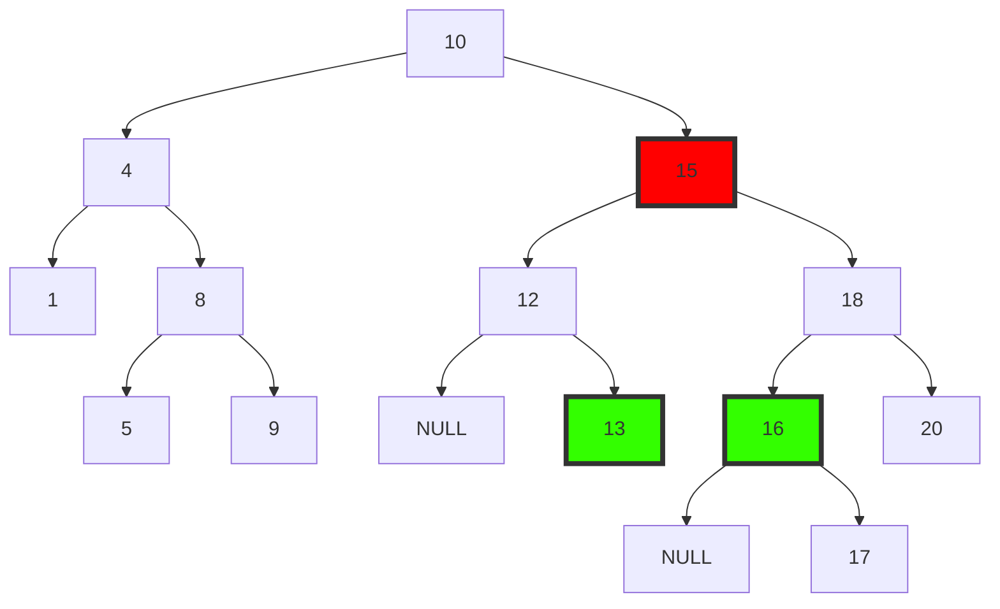

[Ir para o Sumário](../README.md)

# Árvores

## Árvore

São estruturas compostas por **nós** interligados entre si de tal forma que:

- Um nó pode ter um único antecessor. Há apenas um nó que não possui antecessor e se chama **raiz**;
- Um nó pode ter zero ou mais filhos. Um nó que não tem filhos é chamado de **folha**;

Exemplo:



No exemplo acima, a árvore possui os níveis 0, 1, 2, 3, e 4. O nível 0 é a raiz

<table>
	<tr>
		<th>Nível 0</th>
		<td>A</td>
	</tr>
	<tr>
		<th>Nível 1</th>
		<td>B, C, D</td>
	</tr>
	<tr>
		<th>Nível 2</th>
		<td>E, I, J, K, L, U</td>
	</tr>
	<tr>
		<th>Nível 3</th>
		<td>F, G, H, M, N, O, P, Q, R, S</td>
	</tr>
	<tr>
		<th>Nível 4</th>
		<td>V, T</td>
	</tr>
</table>

A árvore é uma estrutura criada também para a resolução do [problema de busca](../revisao/problemaBusca.md) (para a otimização de buscas e armazenamento de dados).

## Árvore Binária

São árvores em que cada nó pode ter, no máximo, dois filhos.



Um nível k pode ter no máximo $2^k$ nós. 

Uma árvore com n nós tem, no mínimo, $\log_2n$ níveis e, no máximo, n níveis.

$$2^0 + 2^1 + 2^2 + 2^3 + ... + 2^{k-1} = n$$

$$n = \frac{1(2^k-1)}{2-1} = 2^k-1$$

n = $2^k$. k é O($logn$)

## Implementação

Uma forma de implementar uma árvore binária é através de lista encadeada.

```c
typedef struct no {
	int dado;
	struct no *esq;
	struct no *dir;
} no;

no *raiz;
```


### Distância

A distância entre dois nós é a quantidade de arestas (ligações) que os unem.

### Altura

A altura de um nó é a maior distância entre este nó e uma folha da árvore. A altura da árvore é a altura da raiz.

> Altura da árvore = Quantidade de níveis - 1

Exemplo:



A altura do nó B, por exemplo, é 4.
> Vale notar que o nó B tem distância 2 para os nós folhas I e J, distância 3 para o nó folha Q e distância 4 para os nós folhas R e S. Logo a altura do nó B é 4 (maior distância).

```c
int altura(no *raiz){
	if (raiz == NULL) return -1; // por convenção (se retornar 0, a altura seria 1)
	else {
		int he = altura(raiz->esq);
		int hd = altura(raiz->dir);
		if (he > hd) return he + 1;
		else return hd + 1;
	}
}
// como o algoritmo percorre todos os nós da árvore, para n nós a complexidade é O(n)
// Esse algoritmo pode ser implementado de forma iterativa também, usando uma pilha (ou fila) para armazenar os nós que precisam ser visitados. Quando for para um lado, empilha o nó do outro lado.
```

### Balanceamento

Uma árvore é dita balanceada se:

1. cada nó possui "aproximadamente" a mesma altura; ou
2. A altura da árvore é O($logn$).


### Percursos em Árvores Binárias

#### 1. Profundidade

Visam alcançar folhas o quanto antes. Há 3 tipos comuns:


> visita: faz alguma operação

##### 1.1 Pré-ordem

- "visita" raiz
- esquerda
- direita

##### 1.2 Em ordem

- esquerda
- "visita" raiz
- direita

##### 1.3 Pós-ordem

- esquerda
- direita
- "visita" raiz

##### Exemplo



- Pré-ordem: 10, 3, 7, 8, 9, 6, 13, 11, 4, 5, 12, 15, 1, 2
- Em ordem: 8, 7, 9, 3, 6, 11, 13, 10, 12, 15, 5, 4, 1, 2
- Pós-ordem: 8, 9, 7, 11, 13, 6, 3, 15, 12, 5, 2, 1, 4, 10


#### 2. Largura

O percurso em largura é um algoritmo que percorre a árvore nível por nível. Em uma árvore binária, isso pode ser implementado usando uma fila. 

O algoritmo funciona adicionando a raiz à fila e, em seguida, entrando em um loop que continua até que a fila esteja vazia. Em cada iteração do loop, ele remove o nó do início da fila, imprime seu valor e adiciona seus filhos à fila.

## Árvore Binária de Busca

É uma árvore binária tal que, para cada nó `v` da árvore, vale que:

$$\text{e.chave} \leq \text{v.chave} \leq \text{d.chave}$$

para qualquer nó `e` (respectivamente `d`) pertencente à subárvore esquerda de `v`. (respectivamente direita de `v`).

<center>



</center>

### Busca

```c
no *busca(no *r, int x){
	if (r == NULL || r->chave == x) return r;
	else{
		if (x < r->chave) busca(r->esq, x);
		else busca(r->dir, x);
	}

}
no busca(no *r, int x){
	while (r != NULL || r->chave != x){
		if (x < r->chave) r = r->esq;
		else r = r->dir;
	}
	return r;
} // complexidade O(log n) para uma árvore balanceada, O(n) caso contrário
```
### Inserção

Inserir a chave no 9 do exemplo abaixo



```c
no *insere(no *r, int y){
	if (r == NULL){
		no *novo = (no *) malloc(sizeof(no));
		novo->chave = y;
		novo->esq = novo->dir = NULL;
		return novo;
	}
	else if (y < r->chave) r->esq = insere(r->esq, y);
	else if (y > r->chave)r->dir = insere(r->dir, y);
	/* faça o que for necessário com a igualdade aqui */
	/* na prática não se insere chaves duplicadas, mas faz alguma manipulação ou atualização */
	return r;
}
```

### Remoção

<span style="color: red">vermelho: </span>elemento a ser removido<br>
<span style="color: green">verde: </span>elementos candidatos a ocuparem o lugar do elemento removido




Essa árvore, percorrida em ordem, é: 0,1,4,5,8,9,10,12,13,15,16,17,18,20

#### Passos

1. Encontrar o nó `v`
2. Encontre o nó `z` que o seja maior da subárvore esquerda de `v` ou o menor da subárvore direita de `v`
3. Troca `v`com `z` (complexidade O(1))
	- isso conserva a propriedade de árvore binária de busca
4. Remova `v` (complexidade O(1))

- Passo 1 + 2:
	- O(log n) se balanceada
	- O(n) caso contrário 

#### Implementação

<!-- ```c
void troca(no *no1, no *no2){
	no *temp = no1;
	no1 = no2;
	no2 = temp;
}
no *remove(no *raiz, int x){
	if (raiz == NULL) return raiz;
	if (x < raiz->chave) raiz->esq = remove(raiz->esq, x);
	else if (x > raiz->chave) raiz->dir = remove(raiz->dir, x);
	else {
		if (raiz->esq == NULL){
			no *temp = raiz->dir;
			free(raiz);
			return temp;
		}
		else if (raiz->dir == NULL){
			no *temp = raiz->esq;
			free(raiz);
			return temp;
		}
		no *temp = menor(raiz->dir);
		raiz->chave = temp->chave;
		raiz->dir = remove(raiz->dir, temp->chave);
	}
	return raiz;	
}

``` -->

```c
no *remove(no *r, int x){
	if (r->esq != NULL){
		no *p = r, *q = r->esq;
		// encontrar o maior da subárvore esquerda
		while (q->dir != NULL){
			p = q;
			q = q->dir;
		}
		r->chave = q->chave;
		if (p == r) p->esq = q->esq;
		else p->dir = q->esq;
		free(q);
		return r;
	}
	else {
		no *q = r->dir;
		free(r);
		return q;
	}
}
```

<!-- É bom analisar 3 pontos em um código:
- corretude
- Boa Definição
- Eficiência -->


