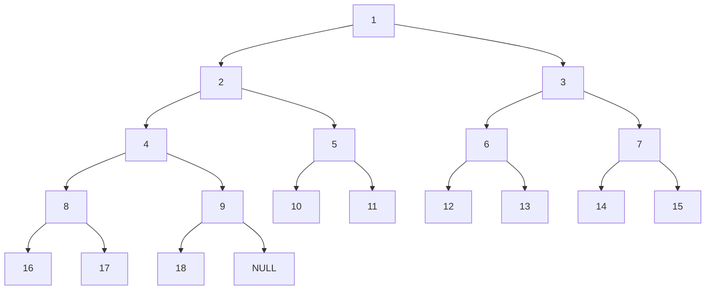
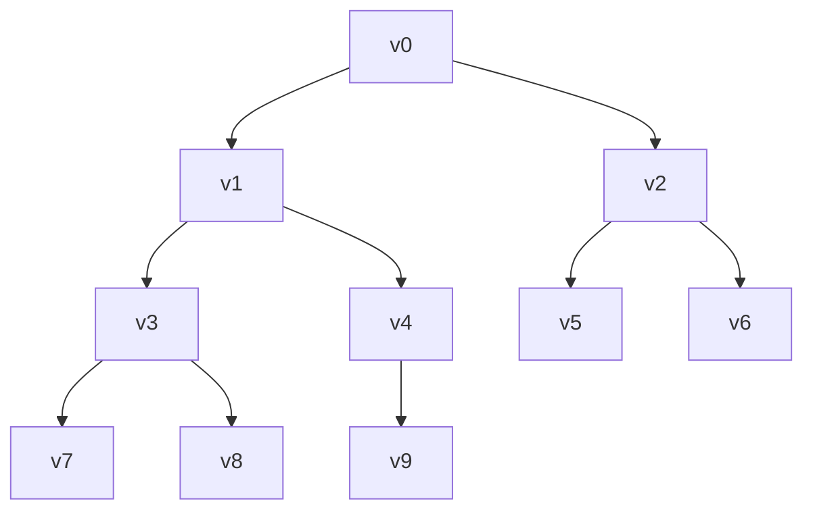
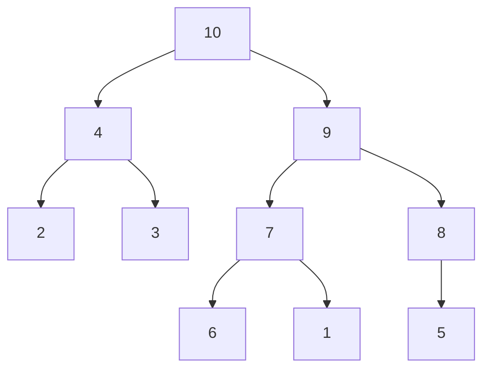

[Ir para o Sumário](../README.md)

# Fila de Prioridades

Uma fila de prioridades é uma estrutura de dados que possui duas operações:

1. Inserção
2. Remoção do elemento de maior prioridade

> Para implementação, haveria duas possibilidades: procurar o de maior prioridade para remover (que custa O(n)) ou inserir a maior prioridade no início da fila ou topo da pilha (que custaria O(n) para calcular a posição)

Implementar fila de prioridades usando vetores ou listas encadeadas implica um custo de O(n) para alguma das duas operações acima

## FP usando árvores

Para implementar FP com árvores, vamos usar **árvores binárias completas**: árvores em que todos os níveis possuem o máximo de nós, com exceção, talvez, do último.



### Implementação de árvores completas



Dado um nó `v[i]` da árvore:

- pai: `v[(i-1)/2]`
- filho esquerdo: `v[2*i+1]`
- filho direito: `v[2*i+2]`

## FP com árvores completas

A árvore seria tal que a raiz é maior que seus filhos.

> Maior pode ser entendido como maior prioridade, ou seja, a raiz é o elemento de maior prioridade

Exemplo



> Esse é um heap de máximo, ou seja, a raiz é o elemento de maior prioridade

## Implementação

### Inserção

```c
typedef struct {
    int *chaves;
    int n, tam; // tam é a capacidade, n é a quantidade
} FP;

FP *cria_fila(int tam){
    FP *fp = (FP *) malloc(sizeof(FP));
    fp->chaves = (int *) malloc(tam * sizeof(int));
    fp->n = 0;
    fp->tam = tam;
    return fp;
}
void sobe_no_heap(FP *fp){
    int k = fp->n-1;
    int pai = (k-1)/2;
    while (k > 0 && fp->chaves[pai] < fp->chaves[k]){
        troca(&fp->chaves[pai], &fp->chaves[k]);
        k = pai;
        pai = (k-1)/2;
    }
} // complexidade O(log n)
void insere(FP *fp, int x){
    if(fp->n + 1 >= fp->tam){ // O(tam)??
        // Só acontece a cada tam inserções
        // Olhando amortizadamente, essa operação torna-se O(1)
        fp->tam *= 2;
        fp->chaves = (int *) realloc(fp->chaves, fp->tam*sizeof(int));
    }
    fp->chaves[fp->n] = x;
    fp->n++;
    sobe_no_heap(fp);
} // complexidade O(log n)
```
### Remoção

```c
int maior(FP *fp, int k, int e, int d, int *m){
    int valor = fp->chaves[k];
    if (e < fp->n){
        if (fp->chaves[e] > fp->chaves[k]){
            *m = e;
            valor = fp->chaves[e];
        }
        if (d < fp->n && fp->chaves[d] > valor){
            *m = d;
            valor = fp->chaves[d];
        }
    }
    return valor;
} // melhorar: remover esq e dir como parametro
int extrai_maximo(Fp *fp){
    if (fp->n > 0){
        fp->n--;
        troca(&fp->chaves[0], &fp->chaves[fp->n]);
        int k=0, esq = 2*k+1, dir = esq+1, m;
        // condição de descida
        while (maior(fp, k, esq, dir, &m) > fp->chaves[k]){
            troca(&fp->chaves[k], &fp->chaves[m]);
            k = m;
            esq = 2*k+1;
            dir = esq+1;
        }
        return fp->chaves[fp->n];
    }
    return 0;
}
// condição antiga do while: esq < fp->n && fp->chaves[esq] > fp->chaves[k] || dir < fp->n && fp->chaves[dir] > fp->chaves
```
