[Ir para o Sumário](../README.md)

# Árvore rubro-negra esquerdistas (Red-Black)

É uma árvore binária de busca (ABB) que satisfaz as seguintes condições:

1. Todo nó é vermelho ou preto	
2. A raiz é preta
3. As folhas são NULL e pretas
4. Se um nó é vermelho, então:
	- Seus dois filhos são pretos
	- É filho esquerdo de um nó preto
5. Para qualquer nó, todo caminho que o liga a uma folha tem a mesma quantidade de nós pretos 
	- não contamos o próprio nó
	- chamamos isso de **altura negra**

> Toda aresta que chega a um nó recebe a mesma cor desse nó


## Representação

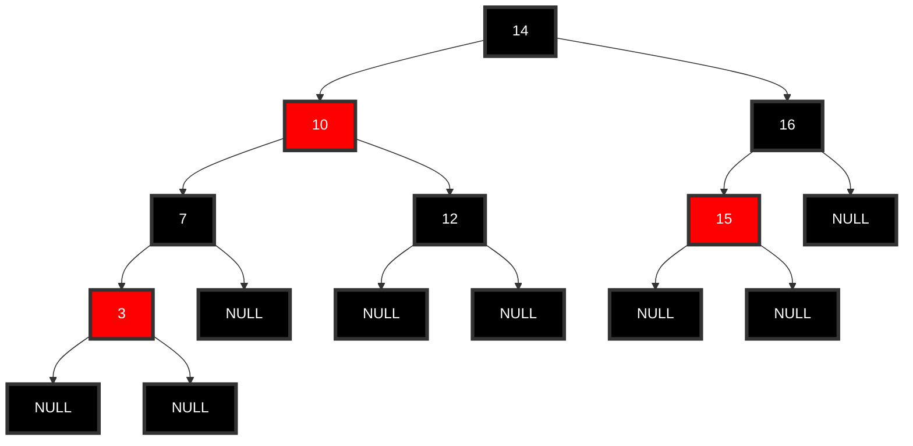

Sendo `bh` a altura negra da árvore. Portanto há, no mínimo, $$2^{bh}-1$$ nós. Por outro lado, $$bh \ge \frac{h}{2}$$

Logo,

$$n \ge 2^{bh}-1 \ge 2^{\frac{h}{2}}-1$$
$$n \ge 2^{\frac{h}{2}}$$
$$\log_2n \ge \frac{h}{2}$$
$$h \le 2\log_2n$$

## Implementação

```c
typedef enum {VERMELHOR, PRETO} cor;

typedef struct no {
	int chave;
	cor cor;
	struct no *esq, *dir;
} no;
```

## Inserção

Todo nó inserido recebe a cor vermelha, pois assim não altera-se a altura negra da árvore.

```c
no *insere(no *r, int x){
	if (r == NULL){
		no *novo = (no *) calloc(1, sizeof(no));
		novo->chave = x;
		novo->cor = VERMELHO;
		return novo;
	} else if (x < r->chave) r->esq = insere(r->esq, x);
	else if (x > r->chave) r->dir = insere(r->dir, x);
	/* correção da subárvore com raiz r */
	return r;
}
```

### Correções

#### Subir cor

<div style="display: flex; justify-content: center; align-items:center;">


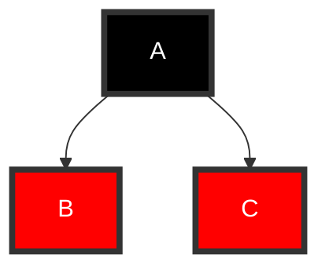

&rarr;


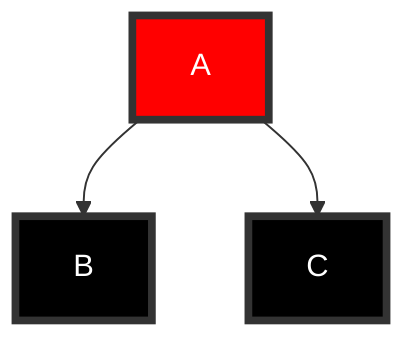


</div>


#### Rotação à esquerda

<div style="display: flex; justify-content: center; align-items:center;">

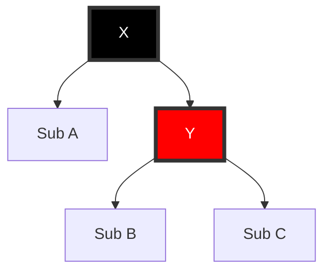

&rarr;

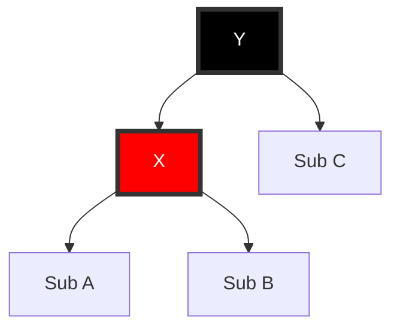
</div>

> O que desce, desce vermelho. O que sobe, assume a cor do pai

#### Rotação à direita

<div style="display: flex; justify-content: center; align-items:center;">


&rarr;


</div>

### Casos

#### Filho esquerdo de um nó preto

Do exemplo anterior, e supondo que queiramos inserir o nó 11

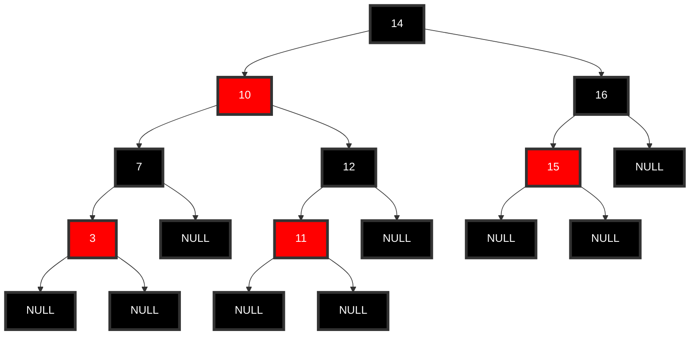

#### Filho direito de um nó preto. Correção: sobe a cor do pai (irmão vermelho)

Agora, vamos inserir o nó 20

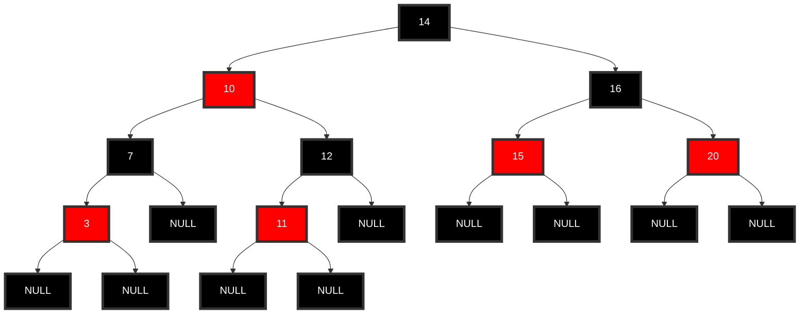

Problema: o 20 é filho direito. Correção: Subir a cor

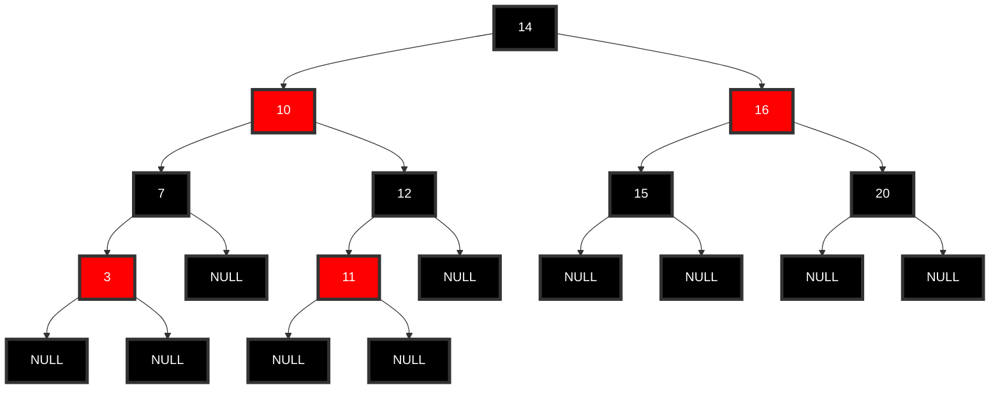

Temos o mesmo problema, então subimos a cor novamente. No entanto, mantemos a raiz com a cor preta

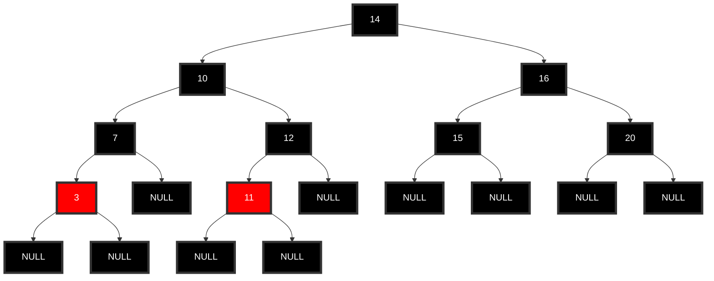

#### Filho direito de um nó preto. Correção: rotação à esquerda (irmão preto)

Inserir o 17

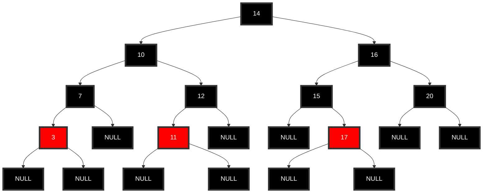

Aplicamos a rotação à esquerda

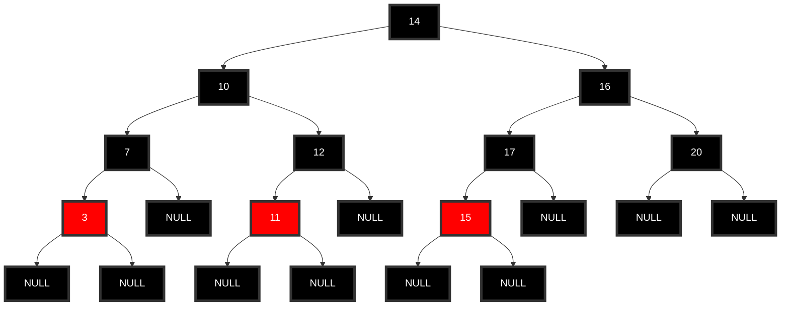

#### Filho esquerdo de um nó vermelho. Correção: rotação à direita no pai preto e sobe cor

Inserir o 1

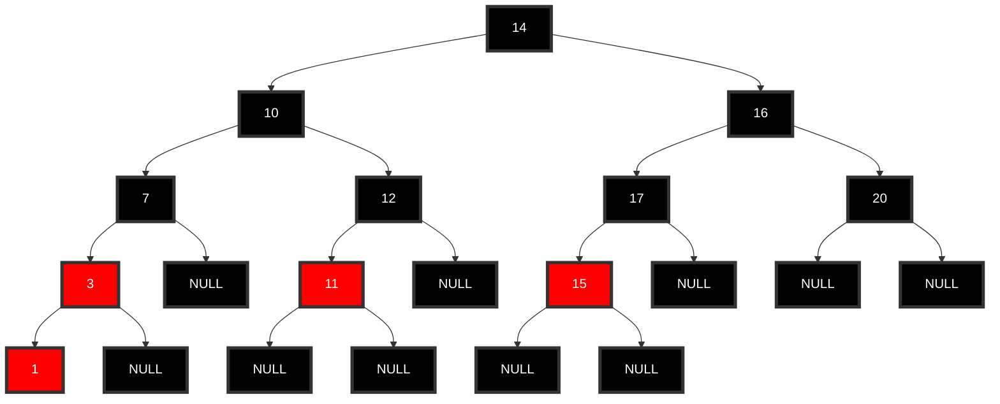

Aplicamos a rotação à direita

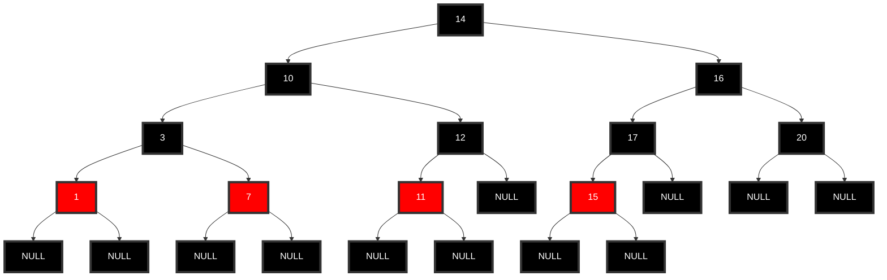

Agora subimos a cor

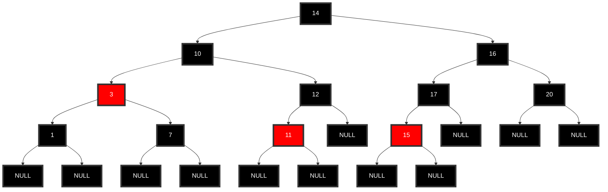

#### Filho direito de um nó vermelho

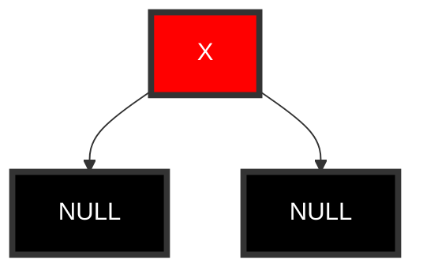

Vamos inserir um filho à direita de X e supondo que X tem uma raiz `r`

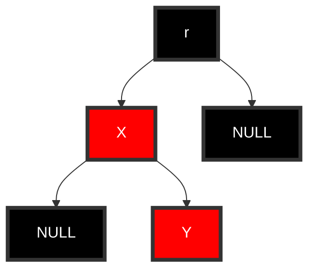

Aplicamos rotação à esquerda em X

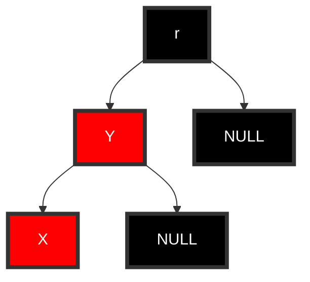

Aplicamos rotação à direita em R

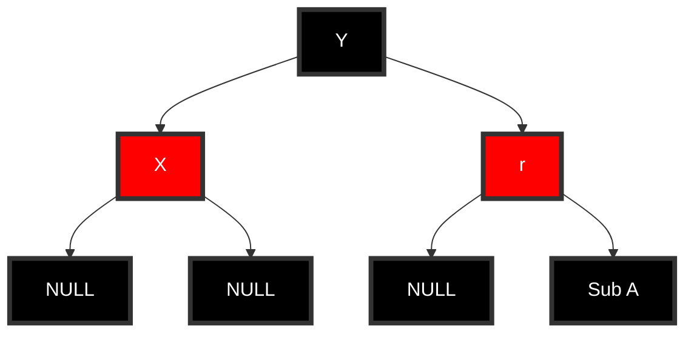

Agora subimos a cor

```mermaid
	graph TD
	classDef red fill:#f00,color:#fff,stroke:#333,stroke-width:4px;
	classDef black fill:#000,color:#fff,stroke:#333,stroke-width:4px;

	1[Y]:::red --> 2[X]:::black
	1 --> 3[r]:::black

	2 --> 4[NULL]:::black
	2 --> 5[NULL]:::black

	3 --> 6[NULL]:::black
	3 --> 7[Sub A]:::black
```

### Função implementada com as correções

```c
int ehPreto(no *r){
	if (r == NULL) return 1;
	else return r->cor == PRETO;
}
int ehVermelho(no *r){
	if (r == NULL) return 0;
	else return r->cor == VERMELHO;
}
no *rotacaoEsquerda(no *r){
	no *x = r->dir;
	x->cor = r->cor;
	r->cor = VERMELHO;
	r->dir = x->esq;
	x->esq = r;
	return x;
}
no *rotacaoDireita(no *r){
	no *x = r->esq;
	x->cor = r->cor;
	r->cor = VERMELHO;
	r->esq = x->dir;
	x->dir = r;
	return x;
}
void sobeCor(no *r){
	r->esq->cor = r->dir->cor = PRETO;
	r->cor = VERMELHO;
}
no *corrige(no *r){
	if (ehPreto(r->esq) && ehVermelho(r->dir))
		r = rotacaoEsquerda(r);
	// o segundo if não tem problema de definição: caso r->esq seja NULL, já retorna Falso
	if (ehVermelho(r->esq) && ehVermelho(r->esq->esq))
		r = rotacaoDireita(r);
	if (ehVermelho(r->esq)  && ehVermelho(r->dir))
		sobeCor(r);
	return r;
}
no *insere(no *r, int x){
	if (r == NULL){
		no *novo = (no *) calloc(1, sizeof(no));
		novo->chave = x;
		novo->cor = VERMELHO;
		return novo;
	} else if (x < r->chave) r->esq = insere(r->esq, x);
	else if (x > r->chave) r->dir = insere(r->dir, x);
	/* correção da subárvore com raiz r */
	r = corrige(r);
	return r;
}

no *insere_novo(no *r, int x){
	r = insere(r,x);
	r->cor = PRETO;
	return r;
} // pode ser que, ao final, a raiz principal tenha se tornado VERMELHA. Então fazemos isso para garantir que se manterá sempre PRETA


```