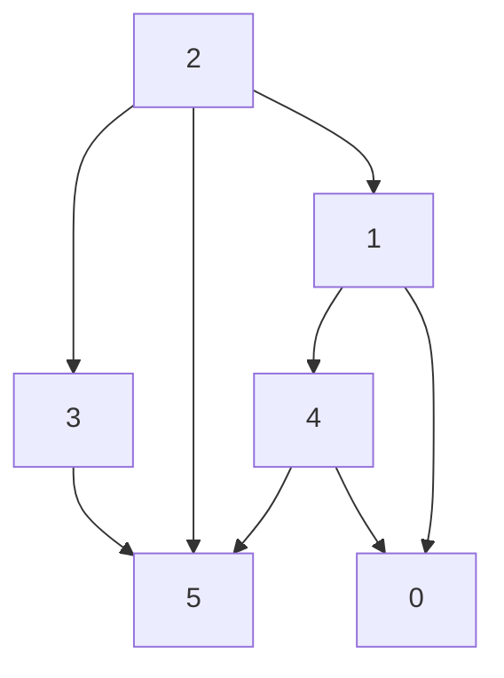
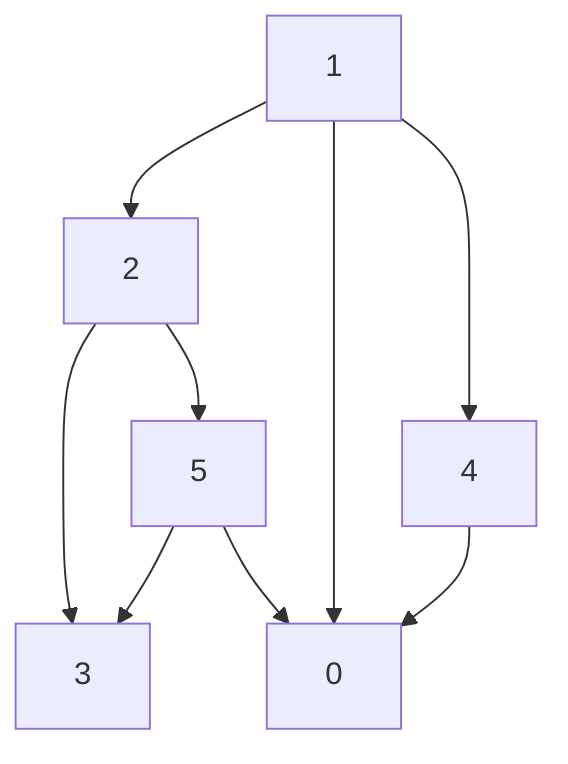
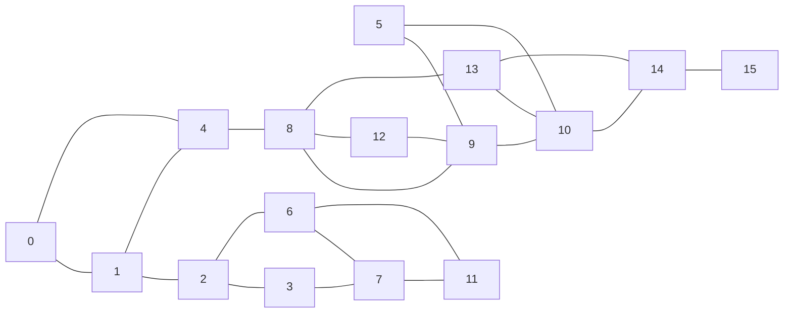
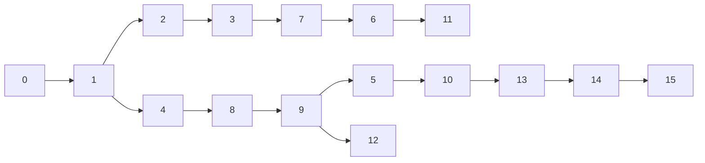
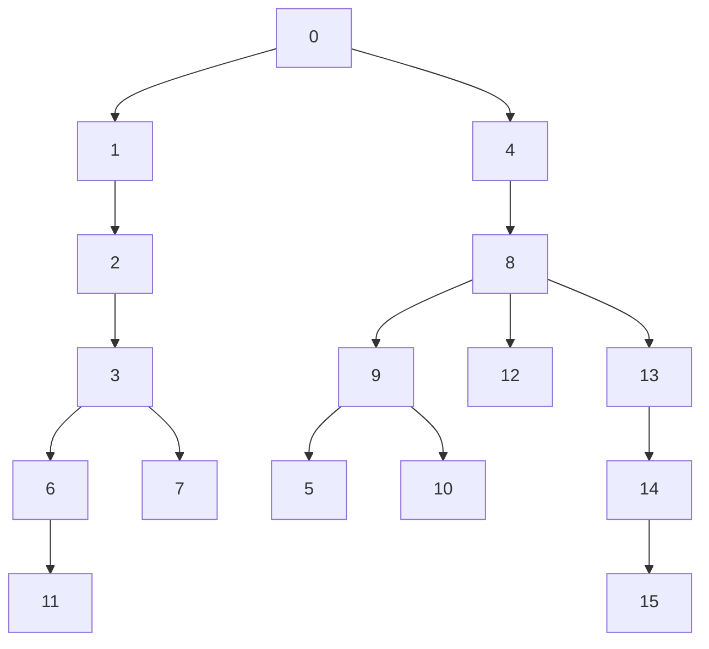

# Grafo

Um grafo é um conjunto de objetos interligados entre si. Os objetos são chamados de **vértices** e as ligações de **arestas**.

Matematicamente, é um par ordenado (V,A) em que V é o conjunto de vértices e A é o conjunto de arestas.




No exemplo acima, temos um grafo com 6 vértices e 8 arestas.

V = {0,1,2,3,4,5}
A = {{0,1}, {0,4}, {1,2}, {1,4}, {2,3}, {2,5}, {3,5}, {4,5}}

Se {u,v} é uma aresta, dizemos que u e v são **adjacentes**.

## Representação de um Grafo

### Matriz de Adjacência

Uma matriz de adjacência é uma matriz quadrada de ordem igual ao número de vértices do grafo. Seja G um grafo com n vértices, a matriz de adjacência de G é uma matriz n x n M tal que:

M[i][j] = 1 se {i,j} é uma aresta de G

|       | 0 | 1 | 2 | 3 | 4 | 5 |
|:-:    |:-:|:-:|:-:|:-:|:-:|:-:|
| **0** |   | 1 |   |   | 1 |   |
| **1** | 1 |   | 1 |   | 1 |   |
| **2** |   | 1 |   | 1 |   | 1 |
| **3** |   |   | 1 |   |   | 1 |
| **4** | 1 | 1 |   |   |   | 1 |
| **5** |   |   | 1 | 1 | 1 |   |

>Problema da esparcidade: Se o grafo é muito esparso, a matriz de adjacência é uma matriz com muitos zeros.

## Lista de Adjacência

Uma lista de adjacência é uma lista de listas. Cada elemento da lista principal corresponde a um vértice do grafo. Cada elemento da lista interna corresponde a um vértice adjacente ao vértice correspondente da lista principal.

<!-- Uma lista de adjacência é um vetor de nós cabeça, onde cada nó cabeça aponta para uma lista encadeada de nós adjacentes. -->


## Implementação

### Matriz de Adjacência

```c
typedef struct {
    int **adj;
    int n;
} grafo;

grafo *cria_grafo(int n){
    grafo *g = (grafo *) malloc(sizeof(grafo));
    g->n = n;
    g->adj = (int **) malloc(n * sizeof(int *));
    for(int i = 0; i < n; i++){
        g->adj[i] = (int *) calloc(n, sizeof(int));
    }
    return g;
} // outra forma seria usar um único calloc para alocar a matriz inteira: g->adj = (int **) calloc(n, sizeof(int **));
```

Para inserir uma aresta entre os vértices u e v:

```c
g->adj[u][v] = g->adj[v][u] = 1;
```

As operações de remoção e verificação de existência de aresta são análogas.

### Lista de Adjacência

```c
typedef struct no {
    int v;
    struct no *prox;
} no;

typedef struct {
    no *adj;
    int n;
} grafo;

grafo *cria_grafo(int n){
    grafo *g = (grafo *) malloc(sizeof(grafo));
    g->n = n;
    g->adj = (no *) calloc(n, sizeof(no));
    return g;
}
```

A inserção consiste em inserir um nó na lista de adjacência do vértice u:


|                          | Matriz |                                   Lista                                   |
|:------------------------:|:------:|:-------------------------------------------------------------------------:|
|       **Inserção**       |  O(1)  | O($\delta_{max}$) <br> porque precisa verificar se a aresta existe ou não |
|       **Remoção**        |  O(1)  |                             O($\delta_{max}$)                             |
| **Existência de Aresta** |  O(1)  |                             O($\delta_{max}$)                             |
|        **Espaço**        | O(n^2) |   O(m + n) ou O (2m + n) <br> m: total de arestas, n: total de vértices   |

> $\delta_{max}$ é o grau máximo do grafo. O grau de um vértice é a quantidade de vértices adjacentes a ele. Vale salientar que $\delta_{max}$ pode ser n-1

## Exemplos

### O vértice mais popular

Suponha o seguinte grafo



> Observação: é importante notar a forma como cada linguagem armazena matrizes. No caso da linguagem C, a matriz é armazenada por linhas, ou seja, a matriz é um vetor de vetores. Sendo assim, para verificar o vertice mais popular usando matriz de adjacência, o desempenho será muito maior se percorrermos a matriz por linhas ao invés de por colunas, pois evita saltos.

```c
// usando matriz de adjacência
int mais_popular(grafo *g){
    int grau_max = 0; v_max, grau;
    for (int i = 0; i < g->n; i++){
        grau = 0;
        for (int j = 0; j < g->n; j++){
            // if (g->adj[j][i]) grau++;  
            grau += g->adj[i][j];
        }
        if (grau >= grau_max){ // adicionando = para o caso onde o grafo tenha apenas um vértice
            grau_max = grau;
            v_max = i;
        }
    }
    return v_max;
} // complexidade O(n²)

```c
// usando lista de adjacência
int mais_popular(grafo *g){
    int grau_max = 0, v_max, grau;
    for (int i = 0; i < g->n; i++){
        grau = 0;
        for (no *v = g->adj[i]->prox; v != NULL; v = v->prox){
            grau++;
        }
        if (grau >= grau_max){
            grau_max = grau;
            v_max = i;
        }
    }
    return v_max;
} // complexidade O(m), onde m é O(n²) no pior caso. O pior caso ocorre quando o grafo é completo (todos os vértices são adjacentes a todos os outros vértices)
```

### Indicação de conexão

Dado um vértice `u`, queremos indicar conexões para `u`.

Se `u` é adjacente à `v` e `v` é adjacente à `w`, então `w` é uma indicação de conexão de `u`.

```c
void imprime_recomendacoes(grafo *g, int u){
    int *rec = calloc(g->n, sizeof(int));
    for (int v=0; v < g->n; v++){
        if (g->adj[v][u]){
            for (int w=0; w < g->n; w++){
                if (g->adj[w][v] && !g->adj[w][u]){
                    rec[w] = 1; // se quisermos guardar a intensidade da recomendação podemos incrementar rec[w] 
                }
            }
        }
    }
    for (int w=0; w < g->n; w++){
        if (rec[w]){
            printf("%d ", w);
        }
    }
} // complexidade O(n) ou O(delta_max) usando listas (onde delta_max é o grau máximo do grafo)
```

## Caminhos

Um caminho entre dois vértices `u` e `v` é uma sequência de vértices adjacentes, sem repetição, começando em `u`  e terminando em `v`.

## Percurso em Grafos

<!-- Imagem Aqui -->


### Busca em Profundidade - DFS (Depth First Search)


A busca em profundidade é um algoritmo recursivo que explora o máximo possível de um ramo antes de retroceder.

O resultado da busca em profundidade é uma árvore de profundidade, que pode ser armazenado em um vetor de pais.



| | 0 | 1 | 2 | 3 | 4 | 5 | 6 | 7 | 8 | 9 | 10 | 11 | 12 | 13 | 14 | 15 |
|:-:|:-:|:-:|:-:|:-:|:-:|:-:|:-:|:-:|:-:|:-:|:-:|:-:|:-:|:-:|:-:|:-:|
| **pai** | 0 | 0 | 1 | 2 | 1 | 9 | 7 | 3 | 4 | 8 | 5 | 6 | 9 | 10 | 13 | 14 |

```c
int caminhhos(grafo *g, int s){
    int *pai = (int *) malloc(g->n * sizeof(int));
    for (int i = 0; i < g->n; i++) pai[i] = -1;
    dfs(g, pai, s, s);
    return pai;
}
void dfs(grafo *g, int *pai, int p, int v){
    pai[v] = p;
    for (int i=0; i < g->n; i++){
        if (g->adj[v][i] && pai[i] == -1){
            dfs(g, pai, v, i);
        }
    }
} // complexidade O(n), porque a cada chamada recursiva, o vértice é marcado como visitado. O(n) recursões são feitas
```

Exercício: Implementar a busca em profundidade usando pilha.

### Busca em Largura - BFS (Breadth First Search)

O resultado da busca em largura é uma árvore de largura e nos dá os menores caminhos em saltos, que pode ser armazenado em um vetor de pais.



| | 0 | 1 | 2 | 3 | 4 | 5 | 6 | 7 | 8 | 9 | 10 | 11 | 12 | 13 | 14 | 15 |
|:-:|:-:|:-:|:-:|:-:|:-:|:-:|:-:|:-:|:-:|:-:|:-:|:-:|:-:|:-:|:-:|:-:|
| **pai** | 0 | 0 | 1 | 2 | 0 | 9 | 3 | 3 | 4 | 8 | 9 | 6 | 8 | 8 | 13 | 14 |

