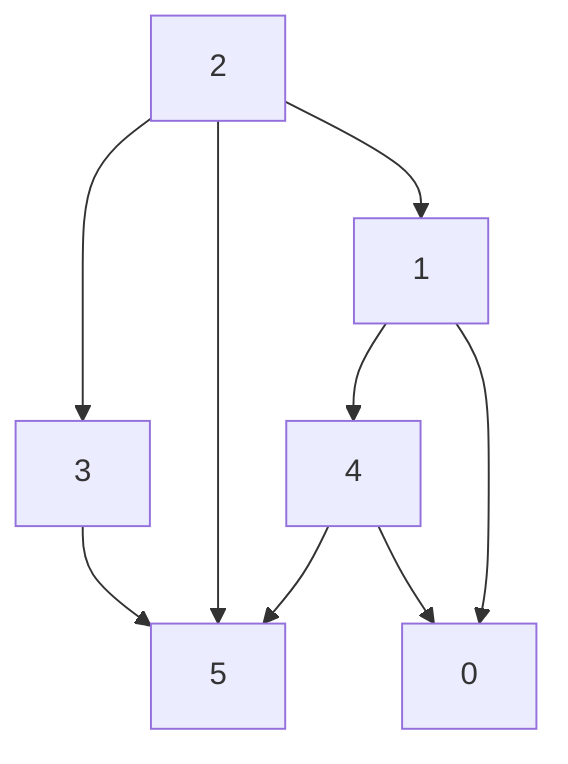

# Grafo

Um grafo é um conjunto de objetos interligados entre si. Os objetos são chamados de **vértices** e as ligações de **arestas**.

Matematicamente, é um par ordenado (V,A) em que V é o conjunto de vértices e A é o conjunto de arestas.

No exemplo acima, temos um grafo com 6 vértices e 8 arestas.

V = {0,1,2,3,4,5}
A = {{0,1}, {0,4}, {1,2}, {1,4}, {2,3}, {2,5}, {3,5}, {4,5}}

Se {u,v} é uma aresta, dizemos que u e v são **adjacentes**.

## Representação de um Grafo

### Matriz de Adjacência

Uma matriz de adjacência é uma matriz quadrada de ordem igual ao número de vértices do grafo. Seja G um grafo com n vértices, a matriz de adjacência de G é uma matriz n x n M tal que:

M[i][j] = 1 se {i,j} é uma aresta de G

|       | 0 | 1 | 2 | 3 | 4 | 5 |
|:-:    |:-:|:-:|:-:|:-:|:-:|:-:|
| **0** |   | 1 |   |   | 1 |   |
| **1** | 1 |   | 1 |   | 1 |   |
| **2** |   | 1 |   | 1 |   | 1 |
| **3** |   |   | 1 |   |   | 1 |
| **4** | 1 | 1 |   |   |   | 1 |
| **5** |   |   | 1 | 1 | 1 |   |

>Problema da esparcidade: Se o grafo é muito esparso, a matriz de adjacência é uma matriz com muitos zeros.

## Lista de Adjacência

Uma lista de adjacência é uma lista de listas. Cada elemento da lista principal corresponde a um vértice do grafo. Cada elemento da lista interna corresponde a um vértice adjacente ao vértice correspondente da lista principal.

<!-- Uma lista de adjacência é um vetor de nós cabeça, onde cada nó cabeça aponta para uma lista encadeada de nós adjacentes. -->

